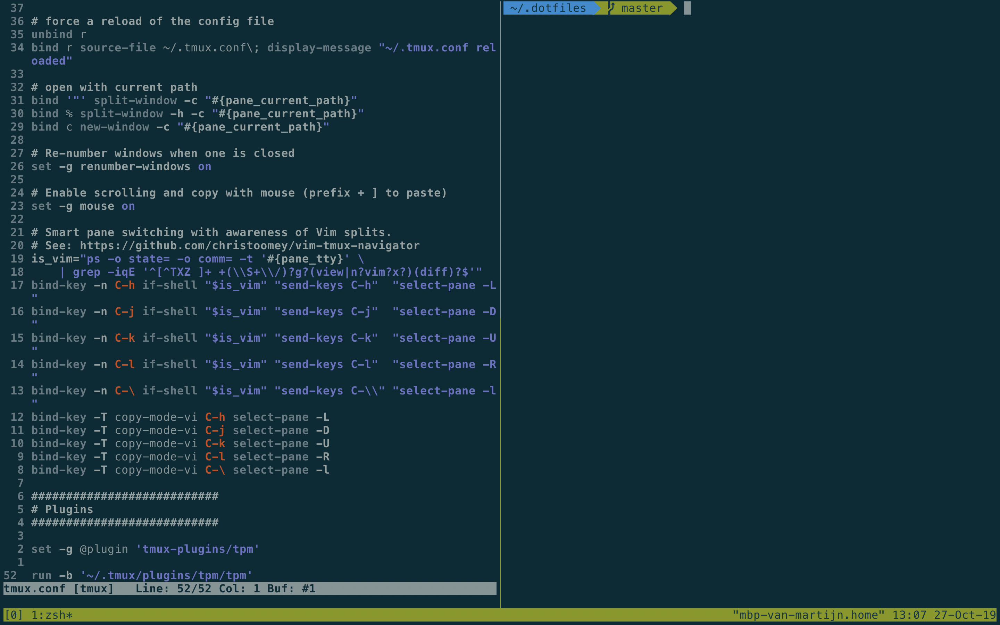

# Dotfiles

 

Inspired by [harmenjanssen/dotfiles](https://github.com/harmenjanssen/dotfiles), [jackfranklin/dotfiles](https://github.com/jackfranklin/dotfiles) and [mathiasbynens/dotfiles](https://github.com/mathiasbynens/dotfiles)

## Utility scripts

### `make`

Lists all the available source. For a fine grained install.

### `bin/apply_git_templates`

After changing a hook in `git_templates/` I want to apply these changes to existings checkouts. This scripts copies the files to `.git/` in the project. It asks to confirm overwriting existing files.

### `bin/dark`

Which tmux and vim to dark mode.

### `bin/light`

Which tmux and vim to light mode.

### `bin/public_port`

When using Docker Compose it's not clear which public ports services expose. Looking into one of the `docker-compose*.yml` files is cumbersome. Use `public_port` to get the public port of a service.

Uses port 80 by default

    $ public_port
    Private port 80
    web: 0.0.0.0:10000

Get the port for MySQL

    $ public_port 3306
    Private port 3306
    db: 0.0.0.0:20000

## Installation

### Step 1: Dotfiles

    $ # install homebrew: https://brew.sh
    $ git clone git://github.com/martijngastkemper/dotfiles ~/.dotfiles
    $ cd ~/.dotfiles
    $ make symlinks

### Step 2: Brew

    $ make install_brew
    $ make install_brew_packages

### Step 3: Shell

Zsh will be installed by Brew. To activate it run:

    $ make configure_zsh

When Zsh is not available but Bash is:

    $ make configure_bash

### Step 4: vim

    $ make configure_vim

### Step 5: tmux

Start tmux befor configuring it.

    $ tmux new-session -d
    $ make configure_tmux

### Step 6: nvm

    $ make install_nvm

### Step 7: Composer

Install Composer globally:

    $ make install_composer

A mechanism to more effectively merge `composer.json` and `composer.lock` files. The Git configuration requires this packages if it has to merge one of the files.

    $ make install_composer_git_merge_driver

### Step 8: Configure MacOS

    $ make configure_macos

Settings to change manually

*Let Caps Lock be an Escape key*
System Preferences -> Keyboard -> Modifier Keys -> Caps Lock -> Esc

*Lock computer immediately*
System Preferences -> Security & Privacy -> General -> Require password ...

## Override Zsh settings

To load settings to Zsh which aren't global add them to:

    $ vim ~/.zshrc.local

## PhpStorm

My PhpStorm settings are stored in a private repo.

The plugins I use:

- .env files support
- IdeaVim
- Makefile support

## Find domain and key for usage in ``defaults``

It's hard to find the right domaian and key of a preference. To find it use ``diff``

    $ defaults read > before
    # make the desired changes to your preferences
    $ defaults read > after
    $ diff before after
