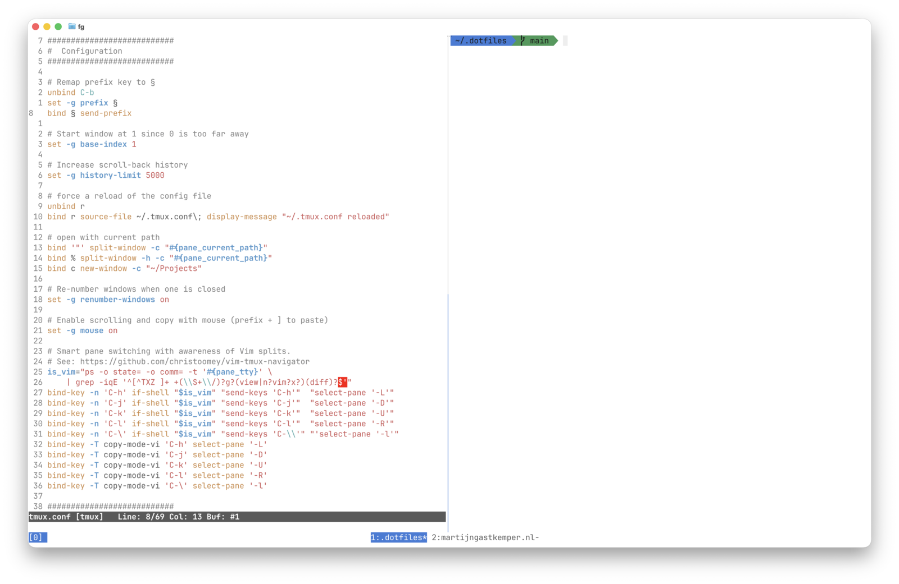

# Dotfiles

[](https://github.com/martijngastkemper/dotfiles/actions)



Inspired by [harmenjanssen/dotfiles](https://github.com/harmenjanssen/dotfiles), [jackfranklin/dotfiles](https://github.com/jackfranklin/dotfiles) and [mathiasbynens/dotfiles](https://github.com/mathiasbynens/dotfiles)

## Utility scripts

### `make`

Lists all the available source. For a fine grained install.

### `bin/apply_git_template`

Sync hooks (and any other files in `git_template/`) into an existing
git repository's `.git/` directory.

Git's template directory is only consulted when a repository is created
(`git init` / `git clone`), so changes to `git_template/hooks/*` don't
propagate to repos that already exist. Run this script from the root
of such a repo to bring it up to date:

```bash
cd path/to/repo
apply_git_template
```

All changes are opt-in per file, so it's safe to run repeatedly.

### `bin/dark`

Switch tmux and vim to dark mode.

### `bin/light`

Switch tmux and vim to light mode.

### `bin/public_port`

When using Docker Compose it's not clear which public ports services expose. Looking into one of the `docker-compose*.yml` files is cumbersome. Use `public_port` to get the public port of a service.

Uses port 80 by default

```bash
public_port
# Private port 80
# web: 0.0.0.0:10000
```

Get the port for MySQL

```bash
public_port 3306
# Private port 3306
# db: 0.0.0.0:20000
```

## Installation

### Step 1: Dotfiles

```bash
git clone git@github.com:martijngastkemper/dotfiles.git ~/.dotfiles
# when git is not available install brew (https://brew.sh), this will install git on MacOS
cd ~/.dotfiles
make symlinks
```

### Step 2: Brew

Follow the installation instructions on [brew.sh](https://brew.sh).

```bash
make install_brew_packages
```

### Step 3: Setup 1Password

1Password should be installed by Brew. Open it, login and open preferences:

General:
- Disable "Keep 1Password in the menu bar"
- Enable "Start at login"
- Disable "Autofill"

Appearance:
- Set "Density" to "Compact"
- Disable "Categories" and "Tags"

Security:
- Enable "Hold Option to toggle revealed fields"

Developer:

- Enable "Show 1Password Developer experience"
- Enable "Use the SSH Agent"
- Set "Open SSH URLs with" to "iTerm2"

### Step 4: Shell

Zsh will be installed by Brew. To activate it run:

```bash
make configure_zsh
```

Also configure bash, so when ZSH isn't available or you have to use Bash some convenient settings are at your hands:

```bash
make configure_bash
```

### Step 5: vim

```bash
make configure_vim
```

### Step 6: tmux

Start tmux before configuring it.

```bash
tmux new-session -d
make configure_tmux
```

### Step 7: Node

```bash
make install_nvm
nvm install 20
make install_yarn
```

### Step 8: Merge Composer dependencies

A mechanism to more effectively merge `composer.json` and `composer.lock` files: [github.com/balbuf/composer-git-merge-driver](https://github.com/balbuf/composer-git-merge-driver)

```bash
make install_composer_git_merge_driver
```

The pre-commit hook in `git_template/hooks/pre-commit` runs `composer validate`
whenever `composer.json` or `composer.lock` is staged, so composer must be
installed to commit in PHP repos.

### Step 9: Configure MacOS

```bash
make configure_macos
```

Settings to change manually

*Let Caps Lock be an Escape key*
System Settings -> Keyboard -> Keyboard Shortcuts -> Modifier Keys -> Caps Lock -> Esc

*Lock computer immediately*
System Settings -> Lock Screen -> Require password after screen saver...

Switch between light and dark tmux theme automatically when macOS appearance changes:

```bash
make configure_theme_switcher
```

### Step 10: Python

Install Python 3 and make the `python` and `pip` binaries available:

```bash
make install_python
```

## Override Zsh settings

To load settings to Zsh which aren't global, add them to:

```bash
vim ~/.zshrc.local
```

## PhpStorm

The plugins I use:

- .env files support
- IdeaVim
- Makefile support
- Prettier
- Terraform and HCL

## Find domain and key for usage in ``defaults``

It's hard to find the right domain and key of a preference. To find it, use ``diff`` showing some extra lines of context:

```bash
defaults read > before
# make the desired changes to your preferences
defaults read > after
diff -C3 before after
```
