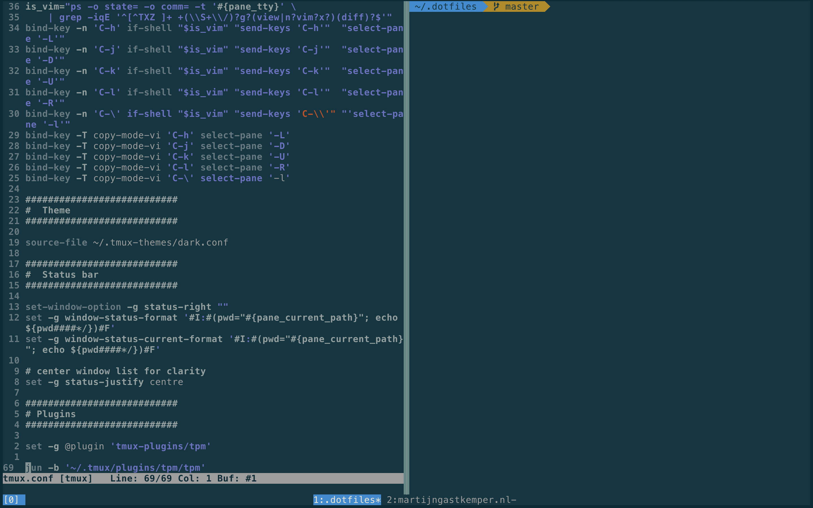

# Dotfiles

Inspired by [harmenjanssen/dotfiles](https://github.com/harmenjanssen/dotfiles), [jackfranklin/dotfiles](https://github.com/jackfranklin/dotfiles) and [mathiasbynens/dotfiles](https://github.com/mathiasbynens/dotfiles)

## Utility scripts

### `make`

Lists all the available source. For a fine grained install.

### `bin/apply_git_templates`

After changing a hook in `git_templates/` I want to apply these changes to existings checkouts. This scripts copies the files to `.git/` in the project. It asks to confirm overwriting existing files.

### `bin/dark`

Switch tmux and vim to dark mode.

### `bin/light`

Switch tmux and vim to light mode.

### `bin/public_port`

When using Docker Compose it's not clear which public ports services expose. Looking into one of the `docker-compose*.yml` files is cumbersome. Use `public_port` to get the public port of a service.

Uses port 80 by default

    $ public_port
    Private port 80
    web: 0.0.0.0:10000

Get the port for MySQL

    $ public_port 3306
    Private port 3306
    db: 0.0.0.0:20000

## Installation

### Step 1: Dotfiles

    $ git clone git@github.com:martijngastkemper/dotfiles.git ~/.dotfiles
    $ # when git is not available install brew (https://brew.sh), this will install git on MacOS
    $ cd ~/.dotfiles
    $ make symlinks

### Step 2: Brew

Follow the installation instructions on [brew.sh](https://brew.sh).

    $ make install_brew_packages

### Step 3: Setup 1Password

1Password should be installed by Brew. Open it, login and open preferences:

General:
- Disable "Keep 1Password in the menu bar"
- Enable "Start at login"
- Disable "Autofill"

Appearance:
- Set "Density" to "Compact"
- Disable "Categories" and "Tags"

Security:
- Enable "Hold Option to toggle revealed fields"

Developer:

- Enable "Show 1Password Developer experience"
- Enable "Use the SSH Agent"
- Set "Open SSH URLs with" to "iTerm2"

### Step 4: Shell

Zsh will be installed by Brew. To activate it run:

    $ make configure_zsh

Also configure bash, so when ZSH isn't available or you have to use Bash some convenient settings are at your hands:

    $ make configure_bash

### Step 5: vim

    $ make configure_vim

### Step 6: tmux

Start tmux before configuring it.

    $ tmux new-session -d
    $ make configure_tmux

### Step 7: Node

    $ make install_nvm
    $ nvm install 20
    $ make install_yarn

### Step 8: Composer

Install Composer 2* globally:

    $ make install_composer

A mechanism to more effectively merge `composer.json` and `composer.lock` files.

    $ make install_composer_git_merge_driver

### Step 9: Configure git

  make configure_git

### Step 10: Configure MacOS

    $ make configure_macos

Settings to change manually

*Let Caps Lock be an Escape key*
System Settings -> Keyboard -> Keyboard Shortcuts -> Modifier Keys -> Caps Lock -> Esc

*Lock computer immediately*
System Settings -> Lock Screen -> Require password after screen saver...

Add a cronjob to switch between light and dark mode automatically based on the mode MacOS has selected.

    $ crontab -l > tmp_crontab
    $ echo "* * * * * sh ~/.dotfiles/macos_switch_theme.sh > /tmp/stdout.cron.log 2> /tmp/stderr.cron.log" >> tmp_crontab
    $ crontab tmp_crontab
    $ rm tmp_crontab

## Override Zsh settings

To load settings to Zsh which aren't global, add them to:

    $ vim ~/.zshrc.local

## PhpStorm

The plugins I use:

- .env files support
- IdeaVim
- Makefile support
- Prettier
- Terraform and HCL

## Find domain and key for usage in ``defaults``

It's hard to find the right domaian and key of a preference. To find it use ``diff``

    $ defaults read > before
    # make the desired changes to your preferences
    $ defaults read > after
    $ diff before after
